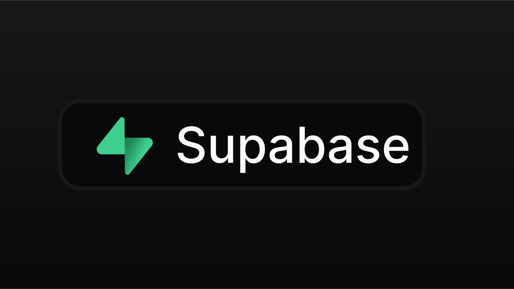

<Warning>
  Supabase integration is in beta. Contact us if you run into any issues. Known issues: Requests to Supabase sporadically result in 502 – we have contacted Supabase about it.
</Warning>

## Overview

[Supabase](https://supabase.com/) is an open-source alternative to Firebase, offering real-time databases, authentication services, and file storage. It is built atop [PostgreSQL](https://www.postgresql.org/), providing robust SQL querying capabilities and seamless integration with existing tools and frameworks. Supabase also features an intuitive web interface for effortless management of users and data.

<Frame>
  
</Frame>

Discover more about Supabase [here](https://supabase.com/docs).

To incorporate Supabase into your Lovable application, start with these steps:

## Supabase setup

Connecting your Lovable app to Supabase is straightforward. Simply follow the steps following steps:

### Step 1: Create a Supabase account

Register a new Supabase account [here](https://app.supabase.com/sign-up) or [sign in](https://app.supabase.com/sign-in) if you already have one.

### Step 2: Create a new project in Supabase.

Click on + New Project, complete the necessary fields, and allow a few minutes for setup.

### Step 3: Connect Supabase to Lovable

1. In your Lovable Editor, locate the Supabase button in the navbar. Click on it and select "Connect Supabase".

2. You will be redirected to a page where you will be able to select the relevant organisation.

3. You will be then redirected back to Lovable, where you will need to select the relevant project within that organisation.

After completing these steps, you will have to wait some seconds for your Supabase integration to finish. Look at the chat for this confirmation.

## Adding Authentication with Supabase

This section details how to integrate the Supabase Authentication service into your Lovable project, providing specific guidelines for setup and usage.

### Initial setup

To initiate authentication, ensure that you have already connected Supabase project to your Lovable project.

To add a basic login page to your project, simply run a prompt similar to the one below.

!!! example "Adding a basic Login page"
Example prompt:

```
Add login
```

You can then create a user by either:

* Creating a user directly via the Supabase Dashboard by navigating Supabase -> Authentication -> Users -> Add user.

* Signing up via the login page you've added

We recommend that you disable the email verification step for now, which you can do in Supabase -> Authentication -> Providers -> Email -> Disable "Confirm email".

## Storing data with Supabase

Supabase offers a comprehensive Postgres database solution. Supabase enhances the PostgreSQL experience by providing tools that simplify database management. These include a table view that resembles a spreadsheet, capabilities to manage and replicate data relationships, a SQL editor, real-time database interactions, automated backups, and easy data import from CSV or Excel files. Additionally, users can activate various PostgreSQL extensions via the Supabase dashboard.

In order to start building UI that uses your data stored in Supabase simply:

1. Ask Lovable to create a new feature and that you expect the data to be stored in Supabase.

2. Lovable will then provide you with a SQL snippet that you can run in the SQL editor in Supabase to create the table(s).

3. Once you confirm that you have run the SQL snippet, then Lovable will update the UI to allow you to interact with the data stored in Supabase.

## Edge Functions

You can now also use Edge Functions to add powerful backend features like:

* Using AI to enhance your app's capabilities

* Sending emails to your users

* Processing payments

* Running scheduled tasks

Lovable will write and deploy Edge Functions to your Supabase project when implementing backend functionality.

When troublehsooting, you  can visit the the logs for your Edge Function in Supabase -> Functions -> Logs.

<Warning>
  Important Note: Before you deploy your app to production or use any real data, you will need to review and set up the appropriate RLS policies. Lovable can help with that.
</Warning>

<iframe width="560" height="315" src="https://www.youtube.com/embed/S8fQMGK41D0" title="YouTube video player" frameborder="0" allow="accelerometer; autoplay; clipboard-write; encrypted-media; gyroscope; picture-in-picture" allowfullscreen />
